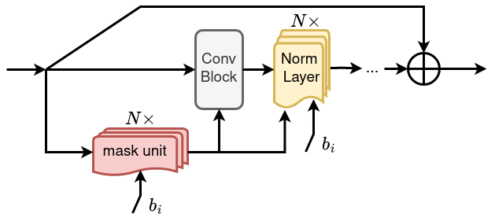

# Budget-aware Dynamic Spatially Adaptive Inference

Given a base model, we propose a spatially adaptive optimization framework, which equips the model with the ability to operate under N target FLOP budgets with minimal parameter count overhead.

<!---
[https://arxiv.org/abs/1912.03203](https://arxiv.org/abs/1912.03203)
-->

> Budget-aware Dynamic Spatially Adaptive Inference  
> Giorgos Zampokas, Christos-Savvas Bouganis and Dimitrios Tzovaras  
> BMVC 2024  

Our work equips spatially adaptive models with the ability to perform inference at multiple target budgets by providing the target budget as input. 

<br>


## Getting Started

```
pip install -r requirements.txt
```

# Single-target models (one budget)

## ResNets
```
# Training
python main_single.py --data /path/to/imagenet/ --model resnet18 -s output_dir --budget 0.5
                                                        resnet50 
                                                        resnet101 
# Evaluation
python main_single.py --data /path/to/imagenet/ --model resnet18 -s output_dir --budget 0.5 --resume trained_model.ckpt --evaluate
                                                        resnet50 
                                                        resnet101 
```

## ConvNeXt
```
# Training
python main_single_ema.py --data /path/to/imagenet/ --model convnext_tiny -s output_dir --budget 0.5
                                                            convnext_small 
                                                            convnext_base 
# Evaluation
python main_single_ema.py --data /path/to/imagenet/ --model convnext_tiny -s output_dir --budget 0.5 --resume trained_model.ckpt --evaluate
                                                            convnext_small 
                                                            convnext_base 
```


# Multi-target models (any number of budgets)

## ResNets
```
# Training
python main_multi.py --data /path/to/imagenet/ --model resnet18_multi -s output_dir --teacher_model resnet18 --budget_targets 0.3 0.5 0.7
                                                        resnet50_multi 
                                                        resnet101_multi 
# Evaluation
python main_multi.py --data /path/to/imagenet/ --model resnet18_multi -s output_dir --budget_targets 0.3 0.5 0.7 --resume trained_model.ckpt --evaluate
                                                        resnet50_multi 
                                                        resnet101_multi 
```

## ConvNeXt
```
# Training
python main_multi_ema.py --data /path/to/imagenet/ --model convnext_tiny_multi -s output_dir --teacher_model convnext_tiny --budget_targets 0.3 0.5 0.7 0.9
                                                            convnext_small_multi 
                                                            convnext_base_multi
# Evaluation
python main_multi_ema.py --data /path/to/imagenet/ --model convnext_tiny_multi -s output_dir --budget_targets 0.3 0.5 0.7 0.9 --resume trained_model.ckpt --evaluate
                                                            convnext_small_multi 
                                                            convnext_base_multi 
```

performance_targets_csv.txt contains the performance targets for each single-budget model under various sparsity levels. Feel free to adjust accordingly.

Useful hyperparameters:

`--budget_targets`: list of sparse budgets to train for

`--awareness_metric`: uses performance of models from performance_targets_csv.txt as targets. To disable target performance aware weights, set to none.

`--teacher_model`: uses pretrained Pytorch model for KD (doesn't have to match base model)


# Acknowledgement
The codebase is built upon and extends [Dynconv](https://github.com/thomasverelst/dynconv) code.
